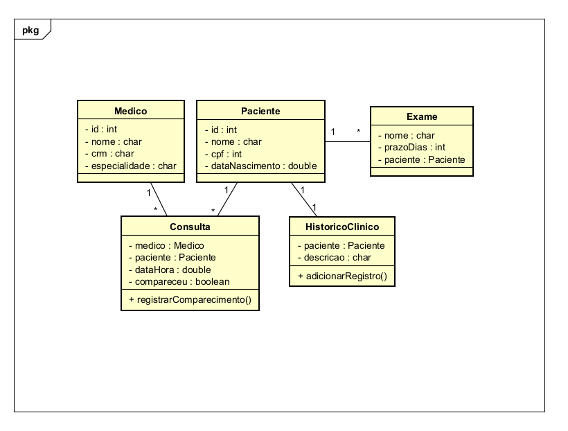

# README – Sistema Simplificado de Clínica Médica

## Descrição do Projeto

Este projeto consiste na implementação de um sistema simplificado de gerenciamento de clínica médica, desenvolvido com o objetivo de aplicar os fundamentos de Programação Orientada a Objetos (POO), conforme os conteúdos estudados em POO I.

O sistema contempla o cadastro e relacionamento entre:

- Médico  
- Paciente  
- Exame  
- Consulta  
- Histórico Clínico  

Além disso, implementa regras de negócio básicas e validações obrigatórias.

---

##  Decisões de Modelagem

### 1- Aplicação do Encapsulamento

Todos os atributos das classes foram declarados como `private`, garantindo proteção do estado interno dos objetos.

O acesso aos dados é feito exclusivamente por meio de métodos públicos (`getters`).  
Isso assegura:

- Controle de acesso  
- Segurança de dados  
- Manutenção da integridade do sistema  

---

### 2- Uso de Construtores com Validação

As validações principais foram implementadas diretamente nos construtores, impedindo a criação de objetos inválidos.

**Exemplos:**

- Consulta não pode ser marcada no passado.  
- Exame deve possuir prazo maior que zero.  
- Histórico clínico não aceita texto vazio.  
- Médico e paciente não podem ser nulos em uma consulta.  

Essa decisão garante que o sistema nunca possua objetos inconsistentes em memória.

---

### 3- Relacionamentos entre Classes

Os relacionamentos foram modelados como **associações**, pois as entidades possuem ciclo de vida independente.

**Associações Implementadas:**

- Consulta → Medico  
- Consulta → Paciente  
- Exame → Paciente  
- HistoricoClinico → Paciente  

**Justificativa:**

Médico e paciente continuam existindo mesmo que uma consulta seja cancelada. Portanto, não se trata de composição, mas de associação obrigatória.

---

### 4- Separação de Responsabilidades

Cada classe possui uma responsabilidade bem definida:

- **Medico** → Representa o profissional  
- **Paciente** → Representa o cliente da clínica  
- **Consulta** → Controla agendamento e comparecimento  
- **Exame** → Representa exames solicitados  
- **HistoricoClinico** → Armazena registros médicos  

Essa divisão melhora:

- Organização  
- Manutenção  
- Legibilidade  
- Escalabilidade futura  

---

### 5- Implementação das Regras de Negócio

As seguintes regras foram implementadas:

- ✔ Consulta não pode ser marcada no passado  
- ✔ Exame deve ter prazo maior que zero  
- ✔ Histórico não aceita texto vazio  
- ✔ Não é possível criar consulta sem médico e paciente  

Essas validações foram realizadas utilizando exceções (`IllegalArgumentException`), garantindo tratamento adequado de erros.

---

### 6- Uso de Tipos Adequados

Foi utilizado:

- `LocalDate` para data de nascimento  
- `LocalDateTime` para agendamento de consultas  

Essa escolha evita uso inadequado de tipos primitivos para manipulação de datas.

---

### 7- Classe Main

A classe `Main` foi criada para simular:

- ✔ Cenário válido  
- X Cenários inválidos  
- ⚠ Casos de borda  

Essa abordagem permite validar o comportamento do sistema na prática e demonstrar a aplicação correta das regras de negócio.

---

##  Estrutura UML 

- Paciente 1..* Consulta  
- Medico 1..* Consulta  
- Paciente 1..* Exame  
- Paciente 1..1 HistoricoClinico  

  

---

##  Conclusão

O projeto demonstra aplicação prática dos principais conceitos de Programação Orientada a Objetos:

- Encapsulamento  
- Associação entre classes  
- Construtores com validação  
- Regras de negócio  
- Organização estrutural  

A modelagem foi realizada buscando clareza, coerência e aderência às boas práticas de POO.
